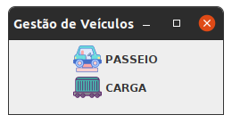
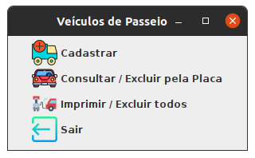
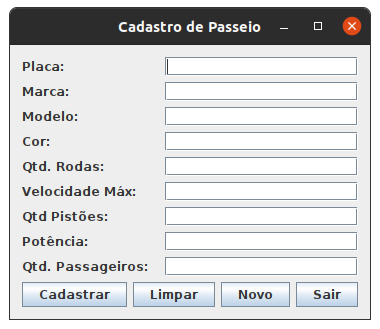
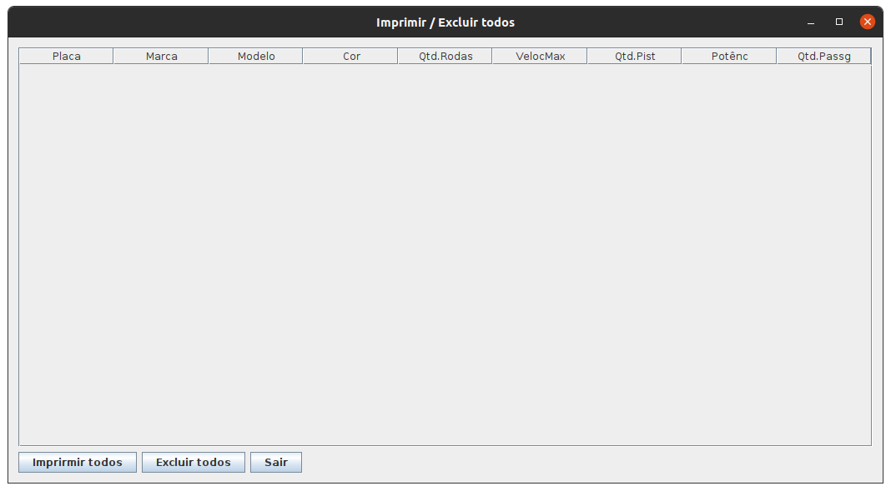

「Java Swing Veículos」
=======

Sistema de veículos usando User Interface do Swing

Screenshots
 

### Recursos

- Cadastrar Veículo de Passeio
- Cadastrar Veículo de Carga
- Imprimir Todos os Veículos de Passeio
- Imprimir Todos os Veículos de Carga
- Imprimir Veículo de Passeio pela Placa
- Imprimir Veículo de Carga pela Placa
- Sair do sistema
